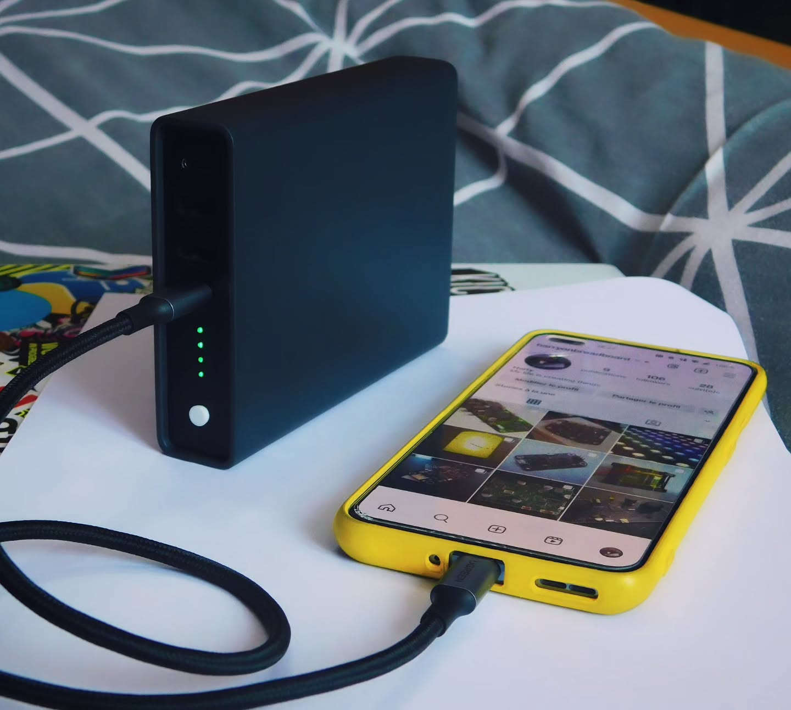
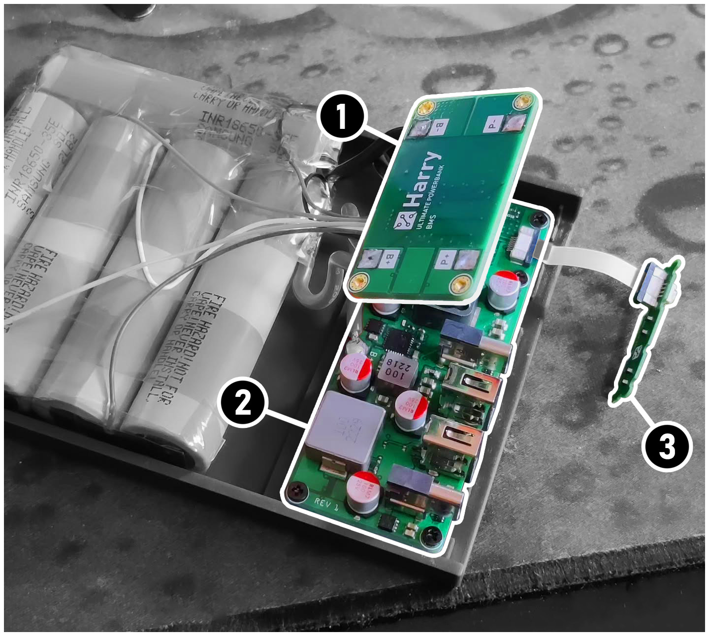

# Ultimate Powerbank

**A portable battery capable of delivering up to 100W of power via USB-C PD**

## ⚡ Specs
4 USB ports:
- USB-C 1 Port: **100W** in and out
- USB-C 2 Port: **20W**
- USB-A 1 Port: **24W**
- USB-A 2 Port: **24W**

Capacity : **17 000 mAh (62 Wh)**

For comparison, a MacBook Pro 13" 2020 has a 58.2 Wh battery. An average smartphone has a 3 000 mAh battery.
So it can charge a MacBook Pro 13" 2020 1 time and a smartphone 5 times.

## ✒ Design

**Powerbank is made out of 3 PCBs:**
- **1** - Battery management system (BMS)
- **2** - Power delivery board
- **3** - Front panel with buttons and LEDs

> Schematics are available in the `schematics` folder

### Battery & BMS
The battery pack is made of 5 [Samsung INR18650-35E](https://www.nkon.nl/fr/samsung-inr18650-35e.html) 18650 cells in series. The BMS is responsible for:
- Balancing the cells during charging
- Protecting the cells from over-discharge and over-charge
- Monitoring the temperature

It has an additional fuse for extra protection.

### Power delivery board
The power delivery board is responsible for delivering the power to the USB ports.
It is based on 3 power management ICs:
- [IP2368](https://www.lcsc.com/datasheet/lcsc_datasheet_2306211713_INJOINIC-IP2368-BZ-VGLIP_C5203723.pdf) for the main USB-C port
- [IP6520_20W](https://www.lcsc.com/datasheet/lcsc_datasheet_2203210916_INJOINIC-IP6520-20W_C2982925.pdf) for the 20W USB-C port
- [IP6538](https://www.lcsc.com/datasheet/lcsc_datasheet_2006111232_INJOINIC-IP6538_C515679.pdf) for both USB-A ports

> The ICs datasheets are in chinese, you can translate them using Google Translate

I choosed an ESP32-C3 as brain of the powerbank.
It is connected to power chips so it can turn them on and off when needed. It controls the LEDs and buttons on the front panel.
When the powerbank button is pressed, the ESP32-C3 wakes up and displays the battery level on the LEDs.
If another press is detected, it turns on USB ports. The main USB-C port is always on as it is used to charge the powerbank.

## 💼 Limitations and improvements
### Overheating
When the powerbank is charging with a high current, the charging IC gets hot and stop the charge until it cools down.
### Communication with the IP2368
In the design process, I wired the IP2368's I2C bus to the ESP32-C3. The problem is that the IP2368 version with I2C is not available in the market so there is no way to communicate with it. I would like to use this communication to get the power consumption and the charge status so I can display it on the LEDs.
### Self-discharge
The powerbank self-discharge is too high. It empties itself in a month. I would like to investigate this issue and find a solution.

## Conclusion
This is by far the most advanced electronic project I've ever made. I learned a lot about batteries, power management and USB-C. I am very proud of the result and the final look of the powerbank. I hope it will be useful to you.
I've worked on this project for 2 years from the idea to the final product. I've made a lot of mistakes, revisions and improvements. I am very happy with the result and I hope you will like it too.

You can find more images in the `images` folder on my [Instgram profile](https://www.instagram.com/harryonbreadboard/)